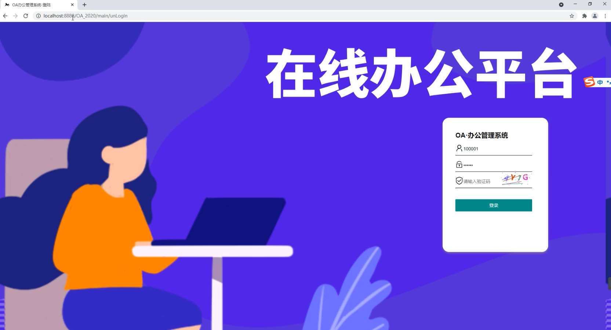
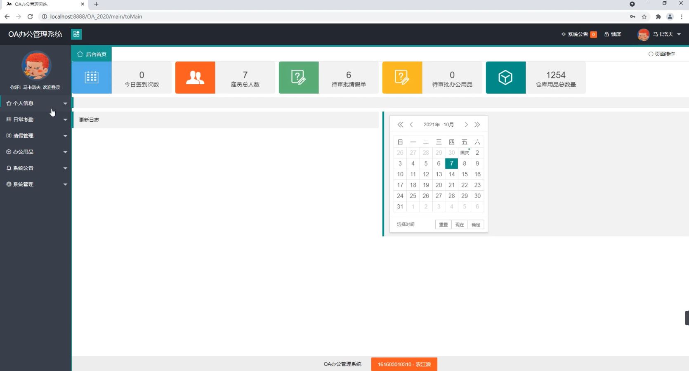
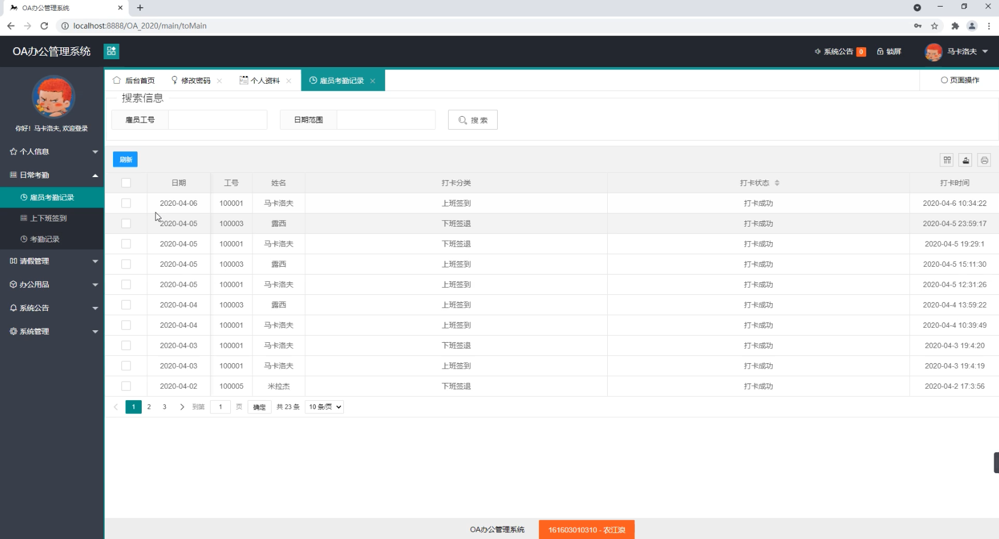
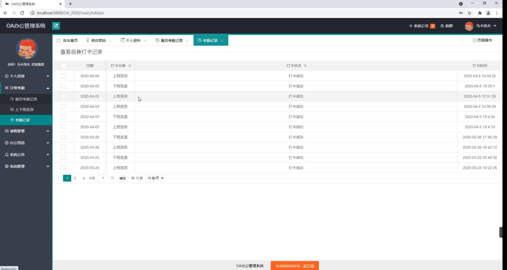
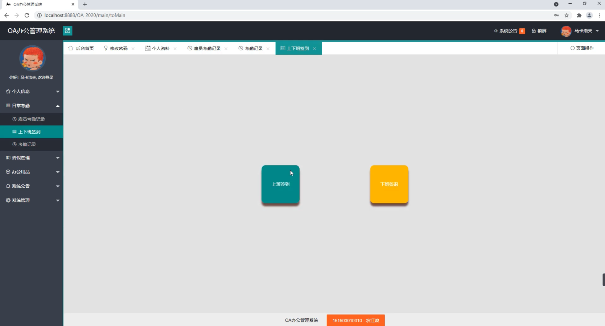
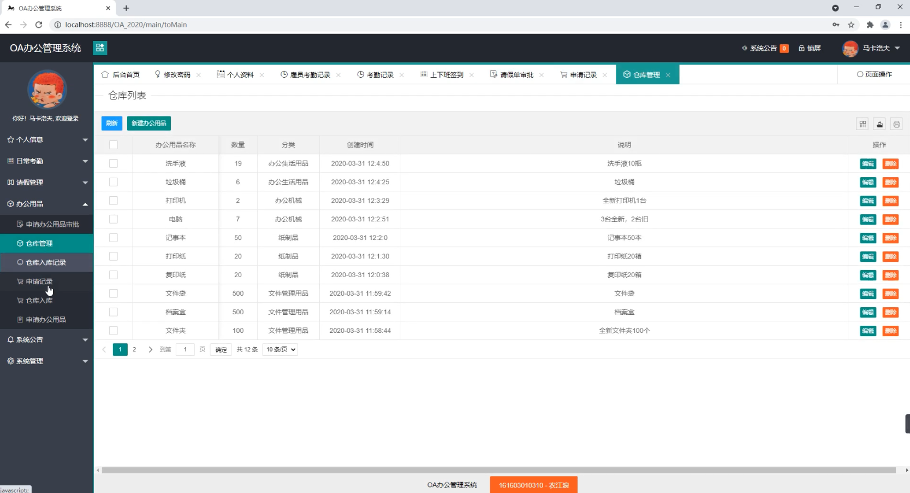
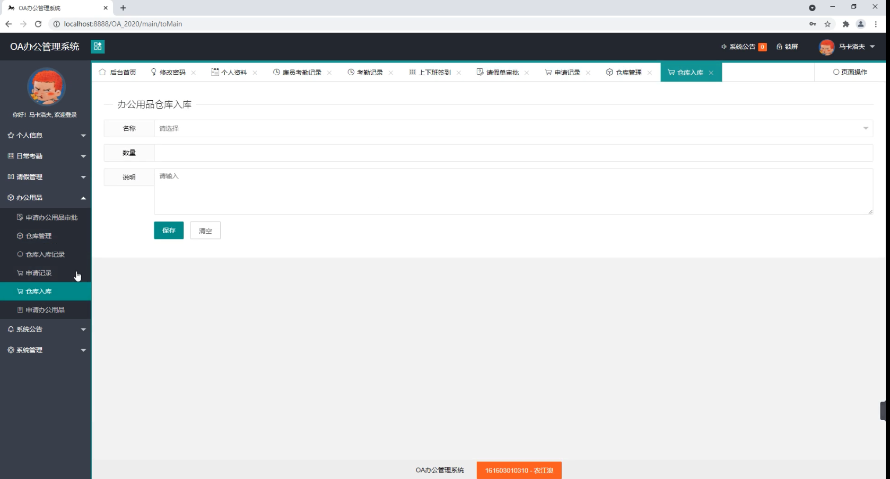

基于SSM的CRM人事管理系统
=
### 完整代码获取地址：从戎源码网 ([https://armycodes.com/](https://armycodes.com/))
### 作者微信：19941326836  QQ：952045282 
### 承接计算机毕业设计、Java毕业设计、Python毕业设计、深度学习、机器学习
### 选题+开题报告+任务书+程序定制+安装调试+论文+答辩ppt 一条龙服务
### 所有选题地址https://github.com/nature924/allProject

一、项目介绍
---
基于SSM框架实现的OA办公管理系统包含两种角色：用户,系统分为前台和后台两大模块，主要功能如下。
### 
【用户】：
1. 个人信息：用户可以查看和修改个人信息，包括姓名、联系方式等。
2. 日常考勤：用户可以进行每日的考勤打卡操作，记录上班和下班时间。
3. 请假管理：用户可以提交请假申请，并记录请假的开始和结束时间。
4. 办公用品：用户可以查看办公用品的库存和申请办公用品。
5. 仓库入库：用户可以将办公用品入库，记录入库的数量和时间。
6. 申请办公用品：用户可以提交申请办公用品的请求，包括申请的数量和用途。
7. 申请办公用品审批：用户可以查看自己提交的办公用品申请，并查看审批状态和结果。
8. 仓库管理：用户可以查看仓库的办公用品库存情况，包括库存数量和剩余数量。
9. 仓库入库记录：用户可以查看办公用品入库的记录，包括入库时间和入库数量。
10. 申请记录：用户可以查看自己提交的办公用品申请记录，包括申请时间和申请数量。
11. 系统公告：用户可以查看系统发布的公告和通知。

二、项目技术
---
- 编程语言：Java
- 数据库：MySQL
- 项目管理工具：Maven
- 前端技术：JSP、HTML、Jquery、Layui、ECharts
- 后端技术：Spring、SpringMVC、MyBatis

三、运行环境
---
- 操作系统：Windows、macOS都可以
- JDK版本：JDK1.8以上都可以
- 开发工具：IDEA、Ecplise、Myecplise都可以
- 数据库: MySQL5.7以上都可以
- Tomcat：任意版本都可以
- Maven：任意版本都可以

四、运行截图
---

### 程序截图：

